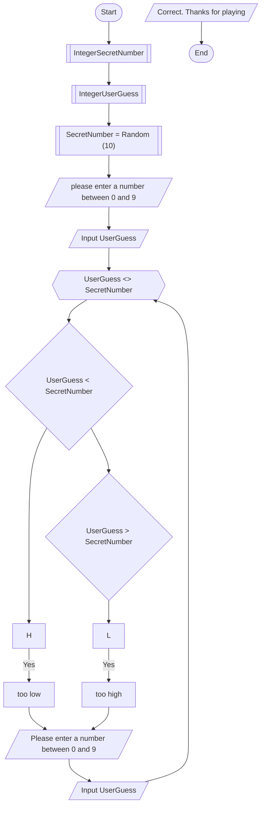

```mermaid
flowchart TD
 Start([Start]) --> 
    A@{ shape: subproc, label: "IntegerSecretNumber" } -->
    B@{ shape: subproc, label: "IntegerUserGuess" } -->
    C@{ shape: subproc, label: "SecretNumber = Random (10)" } --> 
    D@{ shape: lean-r, label: "please enter a number between 0 and 9" } -->
    E@{ shape: lean-r, label: "Input UserGuess" } -->
    F@{ shape: hex, label: "UserGuess <> SecretNumber" } -->  G{"UserGuess < SecretNumber"} -->
    H -- Yes --> I["too low"] -->N
    G{"UserGuess < SecretNumber"} -->K{"UserGuess > SecretNumber"} -->
    L -- Yes --> M["too high"] -->N
   
    N@{ shape: lean-r, label: "Please enter a number between 0 and 9" } --> O@{ shape: lean-r, label: "Input UserGuess" } -->F
    P@{ shape: lean-r, label: "Correct. Thanks for playing" } -->

 End([End])
```

    

