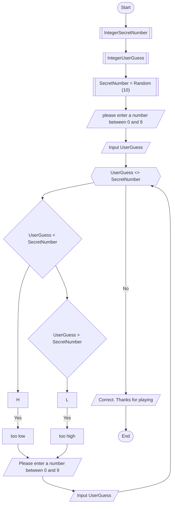

### step 1 input command for secret number
### Step 2 imput command for user guess
### Step 3 Generate number randomizer with a range from 0 to 10
### Step 4 Display text Please enter a number between 0 and 9
### Step 5 Input the user's guess
### Step 6 If they guess correctly go to step 10
### Step 7 If the user's guess is greater than the random number display Output too high, If the user's guess is less than the random number display Output too low.
### Step 8 If answered wrong redirect to please enter a number between 0 and 9
### Step 9 Loop continues untill user correctly guesses the number
### Step 10 If number is correctly guessed output Correct Thanks for playing.

    

