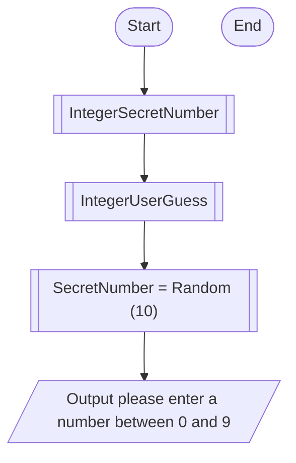

```mermaid
flowchart TD
 Start([Start]) --> 
    A@{ shape: subproc, label: "IntegerSecretNumber" } -->
    B@{ shape: subproc, label: "IntegerUserGuess" } -->
    C@{ shape: subproc, label: "SecretNumber = Random (10)" } --> 
    D@{ shape: lean-r, label: "Output please enter a number between 0 and 9" }


 End([End])
```

    

