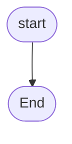

flowchart TD
    Start([Start]) --> DeclareVariables[Declare Integer SecretNumber, UserGuess]
    DeclareVariables --> GenerateSecretNumber[Generate SecretNumber = Random(10)]
    GenerateSecretNumber --> PromptUser[Output: "Please enter a number between 0 and 9"]
    PromptUser --> GetUserInput[Input: UserGuess]
    
    GetUserInput --> CheckEquality{UserGuess == SecretNumber}
    CheckEquality -- True --> CorrectGuess[Output: "Correct. Thanks for playing"]
    CorrectGuess --> End([End])
    
    CheckEquality -- False --> CheckTooLow{UserGuess < SecretNumber}
    CheckTooLow -- True --> OutputTooLow[Output: "Too low"]
    CheckTooLow -- False --> OutputTooHigh[Output: "Too high"]
    
    OutputTooLow --> Reprompt[Output: "Please enter a number between 0 and 9"]
    OutputTooHigh --> Reprompt
    Reprompt --> GetUserInput

    

